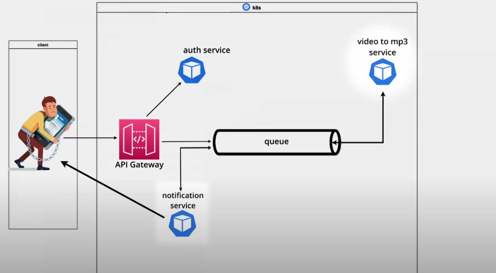

# MP3 Convert Project with Python & Kubernetes

This project demonstrates the implementation of a microservices architecture and distributed systems using a combination of Python, Kubernetes, RabbitMQ, MongoDB, and MySQL. It focuses on creating a scalable and efficient system for converting video files to MP3 format.

## Project Components

1. **Python**: The core programming language used to develop microservices that handle various functionalities such as file uploads, format conversion, and user authentication.
2. **Kubernetes**: The orchestration platform used to manage containerized applications. Kubernetes ensures that the microservices are deployed, scaled, and managed efficiently across a cluster of machines.
3. **RabbitMQ**: The message broker used to facilitate communication between microservices. RabbitMQ handles task queuing, ensuring that video conversion tasks are processed asynchronously and efficiently.
4. **MongoDB**: A NoSQL database used to store metadata and large files. GridFS, a specification for storing and retrieving large files, is utilized to manage video and MP3 files within MongoDB.
5. **MySQL**: A relational database used for storing user data and managing user authentication and authorization information.

## Architecture Overview

1. **Microservices**:
   - **Authentication Service**: Manages user authentication and authorization using JWTs (JSON Web Tokens).
   - **Upload Service**: Handles file uploads from users and stores video files in MongoDB using GridFS.
   - **Conversion Service**: Listens for tasks on RabbitMQ and converts video files to MP3 format.
   - **Download Service**: Allows users to download the converted MP3 files.

2. **Kubernetes**:
   - **Pods**: Each microservice runs in its own Kubernetes pod.
   - **Services**: Kubernetes services manage internal and external access to the microservices.
   - **Ingress Controller**: Manages external access to the services, providing load balancing and SSL termination.
   - **ConfigMaps and Secrets**: Store configuration data and sensitive information securely.

3. **RabbitMQ**:
   - Used to queue conversion tasks.
   - Ensures that the conversion service can process tasks asynchronously and handle workloads efficiently.

4. **MongoDB**:
   - Stores video files and the resulting MP3 files using GridFS.
   - Manages metadata associated with the files.

5. **MySQL**:
   - Stores user credentials and other relational data.
   - Supports the authentication service in managing user accounts and permissions.

## Detailed Workflow

1. **User Authentication**:
   - Users authenticate through the Authentication Service.
   - JWT tokens are issued upon successful authentication.

2. **File Upload**:
   - Authenticated users upload video files via the Upload Service.
   - The service stores these files in MongoDB using GridFS and sends a message to RabbitMQ to queue the conversion task.

3. **File Conversion**:
   - The Conversion Service listens for new tasks on RabbitMQ.
   - When a new task is received, it retrieves the video file from MongoDB, converts it to MP3 format, and stores the MP3 file back in MongoDB.

4. **File Download**:
   - Users can download the converted MP3 files via the Download Service.
   - The service retrieves the MP3 file from MongoDB and sends it to the user.

   
